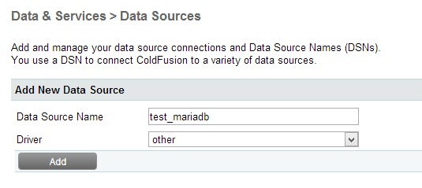
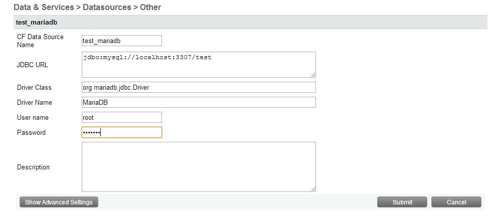

Today before work I figured I'd hook up ColdFusion with [MariaDB](http://mariadb.org/en/) for some future tests. I've heard good things regarding similarity to MySQL (since it's a fork and all) and that the performance is better in some areas. As per the MariaDB site - "MariaDB is a drop-in replacement for MySQL". More about it can be found on the [about page](https://mariadb.org/en/about/).

Getting things going was insanely simple which is always nice.

To start, I pulled down the latest MSI install version from the site at the time (version 10 which is actually still in alpha) and the Java Client Library from the [downloads page](https://downloads.mariadb.org/).

I ran the installer and passed through the typical lot of install options and settings. There are 2 things I altered based on my dev environment on my machine. First - part of the install offered to install HeidiSQL by default for working with the databases which has support for MariaDB. I opted out on this as I use [Navicat for MySQL](http://www.navicat.com/products/navicat-for-mysql) which also supports MariaDB. Second - the default port is `3306` which is the same as MySQL so I simply changed it to `3307`. Once the install was complete I connected to the database server in Navicat and whipped up a quick test database. All good.

Now all I had to do was get ColdFusion talking. Do note that I am running ColdFusion 10 in my dev environment. The first thing I did was drop the client library JAR into the "lib" folder of CF so it can be recognized on the classpath. In my case the path to that directory looks like this - `C:\Apache2\htdocs\cfusion\lib`. A quick restart of the CF server and we're ready to connect.

Once logged into the CF Administrator and on the datasources page, I chose a data source name for my test database and for Driver I selected `other` and click add.

The next page is where we input the required info to connect to MariaDB. The "JDBC URL" field is a url location that points to the server and the database you want to connect to. In this case you use the same structure as with MySQL. For example - `jdbc:mysql://localhost:3307/test`. The other key part is the "Driver Class" field. This is the path to the database driver class of the JAR I dropped into CF earlier; which looks like this - "org.mariadb.jdbc.Driver". Lastly I put `MariaDB` as the `Driver Name` and input the username and password to connect to the server. I didn't alter any of the advanced settings. Upon submitting the database was added successfully.

And there we have it. Real simple. A basic `<cfquery>` to the database yielded as expected when I tested it. I haven't done anything extensive or convert a previous database but it was cool to try so far.

Cheers.