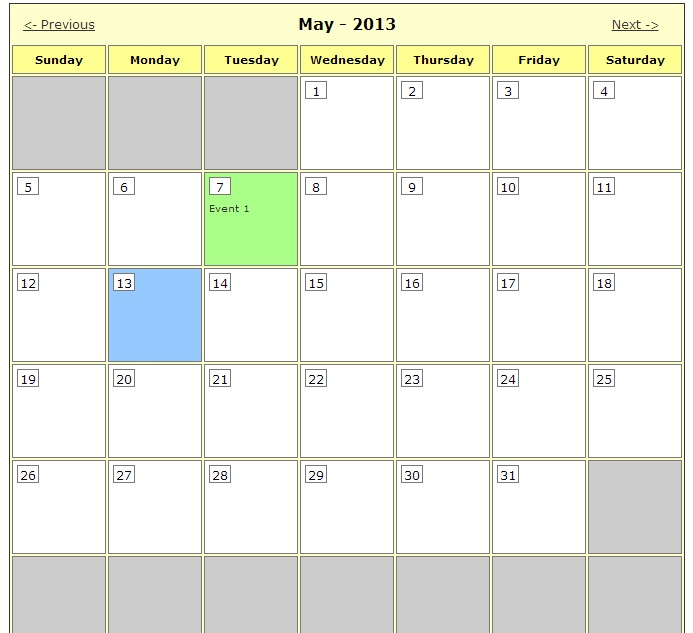
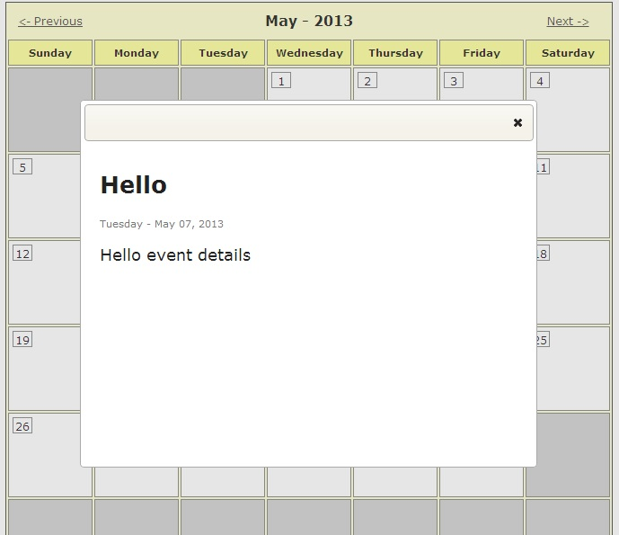

While looking through my collection of code snippets, test apps etc. I came across a very basic calendar app I built for a client a year or so ago. It makes use of ColdFusion for nitty gritty bits, like cycling through months/years, and jQuery / jQuery UI to display "event" info that can be dynamically displayed on a given date. The example code uses hardcoded event info but applying dynamic content from a database or object is quite easy and straight forward. All in all I figured why not share my bits on it.

The code was based on, and still more or less in tact to the original, sample code from Bobby Hartsfield's tutorial at easycfm.com - [A Basic Calendar Application to Build on?](http://tutorial180.easycfm.com/index.cfm?fuseaction=tutorial&tutorialID=180). I wanted to give credit and could not find the source for the life of me. Lo and behold I had it bookmarked the entire time haha. The original publish was back in 2003 so it's dated anymore; but his example was spot on to what I needed at the time and damn simple to modify. Bobby breaks down and documents the base of the code extremely well in the original tutorial so I won't be a broken record.

My version applys the actual calendar code as a module included in a index.cfm as the calling page. I applied some CSS to prettify the calendar's look and feel; while also making it easier to modify should you want to shrink it or use it for mobile layouts. I used jQuery UI to display info on a given day in a modal. The version of jQuery is old but it works. ;) Of course in no way are the JavaScript bits required. The dynamic content will simply display above the calendar itself. Not the best route in all cases as you could always link to a page that displays only the content.

Here is an example of the calendar:

And an example of displaying content details on the calendar in a jQuery UI modal:

The source code and all of it's goodness can be [found over on my GitHub](https://github.com/tonyjunkes/cf-calendar). This was actually my first experince using GitHub so that was pretty cool.