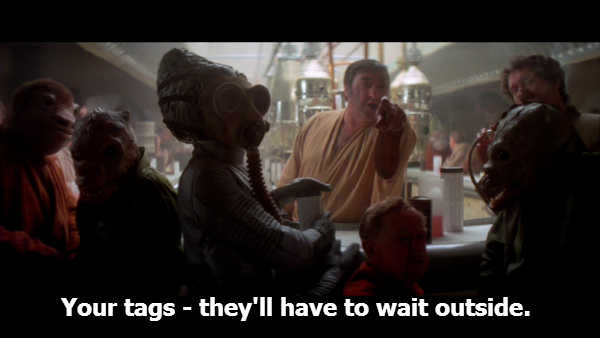

So after 2 weeks or so of churning away in my free time, I've gone and written some documentation. Of what you say? Well, I made an attempt to write some bits on converting CFML tag-based code to CFScript. It's nothing fancy. More of a "example A, example B" kinda layout where one chunk is in tags and the other is in script.

Back at the beginning of firing this up, I was doing a handful of refactoring legacy code. This involved some 2000 odd lines of tags being swapped out for CFScript; on top of making the code itself more reliable with the modern world. I had mentioned my victories over the behemoth of clutter on Twitter and Adam Cameron chimed in suggesting a blog post in regards to my conversions might give some folks a good kick-start into the CFScript world. Thanks for that, Adam! Based on what I've put together, I hope it does. With some inspiration from other community docs, [including Adam's](https://github.com/adamcameron/cfscript/blob/master/cfscript.md), I think it's all coming together nicely.

I spent a good bit of time writing up some filler nonsense and some various code block examples. All to be displayed on this blog. Then I thought - "WTH are you doing? Throw that shit on Github!". Check it out: [CFML Tags to CFScript](https://github.com/tonyjunkes/cfml-tags-to-cfscript) - If you're still writing in only tags and you haven't learned CFScript, it'll only make you a better CFML developer!

Cheers!