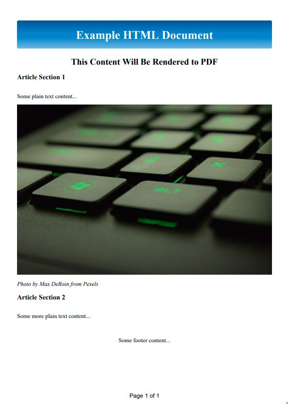

Following my last post on using [Apache PDFBox](https://pdfbox.apache.org/), I'll be doing a series of sorts using another Java library that leverages it - [Open HTML to PDF](https://github.com/danfickle/openhtmltopdf) by [@danfickle](https://github.com/danfickle).

In this post, I'll show how to use the library to generate a PDF from HTML and CSS.

From the GitHub repo, OpenHTMLToPDF is:
> An HTML to PDF library for the JVM. Based on Flying Saucer and Apache PDF-BOX 2. With SVG image support. Now also with accessible PDF support (WCAG, Section 508, PDF/UA)!

OpenHTMLToPDF was a breeze to get up and running, performs well, and the CSS and SVG support is excellent in comparison to other options out there. I've integrated this library into some heavy file generation at work and have been super happy with it. Plus, being open-source gives the bonus of bug/security fixes and feature enhancements in a relatively timely manner.

#### Why Not ColdFusion's Native Support?

I found cfhtmltopdf lacking in CSS support among various bugs with page layouts. It even underperformed compared to cfdocument in some of the scenarios I initially tested. For older style layouts, it's OK. In the past, I've joined others in commenting on OLD bug tickets tucked away in Adobe's tracker of despair. I'm willing to accept a lack of knowledge of the features, but I couldn't be bothered to pursue solutions further, unfortunately.

I'm not here to bash Adobe's PDF features though, and I've never used Lucee's extension.

So anyway...

#### Demo Code

There is a [demo application on GitHub](https://github.com/tonyjunkes/cfml-openhtmltopdf-examples) that I will be adding to as I post more examples.

## CommandBox Setup
---

This demo will set everything up to use [CommandBox](https://www.ortussolutions.com/products/commandbox) for the JAR dependencies and running the server instance.

There are a few dependencies for CommandBox to pull in via `box.json`. They will live in the `/lib` folder. This includes OpenHTMLToPDF, PDFBox, and jsoup.

```json
// box.json
{
    "name":"CFML OpenHTMLToPDF Examples",
    "dependencies":{
        "openhtmltopdf-core-1.0.10":"jar:https://search.maven.org/remotecontent?filepath=com/openhtmltopdf/openhtmltopdf-core/1.0.10/openhtmltopdf-core-1.0.10.jar",
        "openhtmltopdf-java2d-1.0.10":"jar:https://search.maven.org/remotecontent?filepath=com/openhtmltopdf/openhtmltopdf-java2d/1.0.10/openhtmltopdf-java2d-1.0.10.jar",
        "openhtmltopdf-pdfbox-1.0.10":"jar:https://search.maven.org/remotecontent?filepath=com/openhtmltopdf/openhtmltopdf-pdfbox/1.0.10/openhtmltopdf-pdfbox-1.0.10.jar",
        "pdfbox-2.0.26":"jar:https://search.maven.org/remotecontent?filepath=org/apache/pdfbox/pdfbox/2.0.26/pdfbox-2.0.26.jar",
        "xmpbox-2.0.26":"jar:https://search.maven.org/remotecontent?filepath=org/apache/pdfbox/xmpbox/2.0.26/xmpbox-2.0.26.jar",
        "fontbox-2.0.26":"jar:https://search.maven.org/remotecontent?filepath=org/apache/pdfbox/fontbox/2.0.26/fontbox-2.0.26.jar",
        "graphics2d-0.38":"jar:https://search.maven.org/remotecontent?filepath=de/rototor/pdfbox/graphics2d/0.38/graphics2d-0.38.jar",
        "jsoup-1.15.1":"jar:https://search.maven.org/remotecontent?filepath=org/jsoup/jsoup/1.15.1/jsoup-1.15.1.jar"
    },
    "installPaths":{
        "openhtmltopdf-core-1.0.10":"lib/openhtmltopdf-core-1.0.10/",
        "openhtmltopdf-java2d-1.0.10":"lib/openhtmltopdf-java2d-1.0.10/",
        "openhtmltopdf-pdfbox-1.0.10":"lib/openhtmltopdf-pdfbox-1.0.10/",
        "pdfbox-2.0.26":"lib/pdfbox-2.0.26/",
        "xmpbox-2.0.26":"lib/xmpbox-2.0.26/",
        "fontbox-2.0.26":"lib/fontbox-2.0.26/",
        "graphics2d-0.38":"lib/graphics2d-0.38/",
        "jsoup-1.15.1":"lib/jsoup-1.15.1/"
    }
}
```

From within the project directory, running `box install` will pull down the JAR files and place them in the `/lib` folder.

## Application.cfc
---

`Application.cfc` is straight forward. We set an array of the JAR file paths for `this.javaSettings` using `directoryList()` and create mappings to the HTML/CSS/images (/resources), the CFC generating the PDF (/components), and a place for generated PDFs (/output).

```js
// Application.cfc
component {
    this.name = hash(getBaseTemplatePath());
    this.applicationTimeout = createTimeSpan(0, 2, 0, 0);
    this.javaSettings.loadPaths = directoryList(expandPath("/lib"), true, "path", "*.jar");
    this.mappings = {
        "/resources": expandPath("/resources"),
        "/components": expandPath("/components"),
        "/output": expandPath("/output")
    };
}
```

## CSS

The CSS will be relatively simple, but I've included some styling that many libraries do not support.

```css
/*example.css*/
@page {
    size: A4;
    @bottom-center {
        font-family: Tahoma, Geneva, Verdana, sans-serif;
        content: "Page " counter(page) " of " counter(pages);
    }
}

html, body { margin: 0; }
header, footer { text-align: center; }
p { line-height: 3em; }

.page__header {
    color: #ffffff;
    padding: 20px;
    border-radius: 5px;
    background-image: linear-gradient(to bottom, #1e5799 0%, #2989d8 50%, #207cca 51%, #7db9e8 100%);
}

.center {
    display: block;
    margin-left: auto;
    margin-right: auto;
    width: 100%;
}
```

## HTML

The HTML document will use an HTML5 doctype, making use of that spec's supported elements. There is also a JPG image included for the PDF render.

```html
<!-- example.html -->
<!DOCTYPE html>
<html>
    <head>
        <title>Example HTML5 Document Using CSS3 Styling</title>
        <link rel="stylesheet" href="http://127.0.0.1:8520/resources/css/example.css">
    </head>

    <body>
        <header>
            <h1 class="page__header">Example HTML Document</h1>
            <h2>This Content Will Be Rendered to PDF</h2>
        </header>

        <main>
            <section>
                <article>
                    <h3>Article Section 1</h3>
                    <p>Some plain text content...</p>
                    <div>
                        
                    </div>
                    <div><cite>Photo by Max DeRoin from Pexels</cite></div>
                </article>
                <article>
                    <h3>Article Section 2</h3>
                    <p>Some more plain text content...</p>
                </article>
            </section>
        </main>

        <footer>
            <p>Some footer content...</p>
        </footer>
    </body>
</html>
```

## PDF Generation Component
---

Being a Java library, there are some Java objects we must make use of to satisfy OpenHTMLToPDF. This includes passing a W3cDom object to jsoup to form the HTML5 and a FileOutputStream for writing the result PDF.

- The function then parses the file path passed in and creates the output directory if it does not exist.
- URI is set to resolve the resource paths used in the HTML.
- jsoup is used to set the HTML into a usable object for the rest of the process.
- An output stream is created, pointing to the passed-in file path, and the PDF is streamed to it using OpenHTMLToPDF's `PdfRendererBuilder`.
- At the end of the entire process the stream is closed via `pdfFileOutputStream?.close()`.


```js
component displayname="Write HTML to PDF Example"
    output=false
{
    public void function writeHTMLToPDF(
        required string html,
        required string filePath
    ) {
        try{
            // Instantiate Java classes
            var Jsoup = createObject("java", "org.jsoup.Jsoup");
            var W3CDom = createObject("java", "org.jsoup.helper.W3CDom");
            var PdfRendererBuilder = createObject("java", "com.openhtmltopdf.pdfboxout.PdfRendererBuilder");
            var FileOutputStream = createObject("java", "java.io.FileOutputStream");

            // Resolve file generation path
            var fileLocation = arguments.filePath.listToArray("\/").slice(1, -1).toList("/");
            if (!directoryExists(fileLocation)) directoryCreate(fileLocation);

            // Set the URI path for external resources in the HTML
            var URI = getPageContext().getRequest().getScheme() & "://" & cgi.server_name;

            // Convert HTML5 document string to a W3CDocument object for parsing to PDF
            var jsoupDoc = Jsoup.parse(arguments.html);
            var w3cDoc = W3CDom.init().fromJsoup(jsoupDoc);

            // Stream W3CDocument to PDF format
            var pdfFileOutputStream = FileOutputStream.init(arguments.filePath, false);
            var pdfBuilder = PdfRendererBuilder
                .useFastMode()
                .withW3cDocument(w3cDoc, URI)
                .toStream(pdfFileOutputStream)
                .run();
        }
        catch(any e) {
            writeLog(e);
        }
        finally {
            // Ensure on succes OR error, all streams are closed!
            pdfFileOutputStream?.close();
        }
    }
}
```

## Output

Passing HTML and a result file path to the function gives us a PDF like this...



## More to Come

I plan to put out more bite-size examples like this one working with OpenHTMLToPDF. Such as appending documents, building/storing/writing from memory, and building a zip archive of rendered PDFs from memory; to name a few.

Until then...

Cheers & Happy Coding!