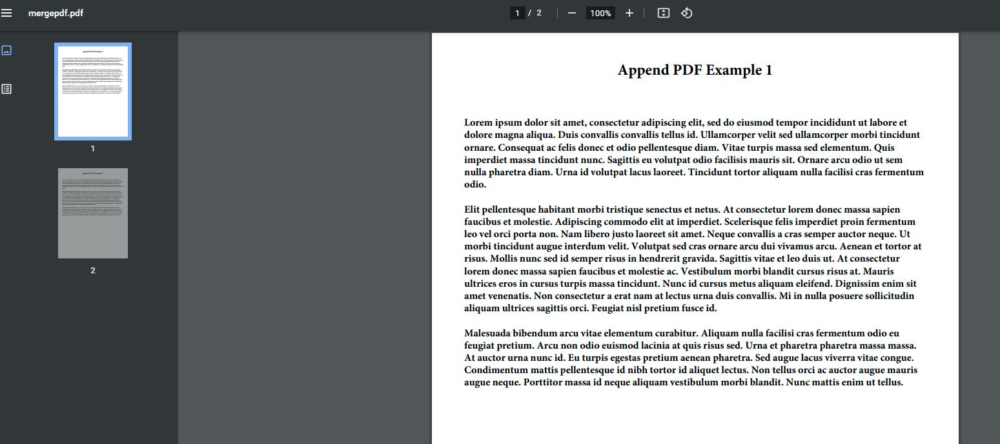

Let's look at an example using [Apache PDFBox](https://pdfbox.apache.org/) to merge one or more PDF files into a single PDF.

This will demonstrate taking two separate PDF files, reading them as binary, and using PDFBox's `PDFMergerUtility` to append them into a new document object before writing the final file out. The whole process will work with the files in memory using some Java input and output streams.

The example PDFs used for merging will just be plain files with some dummy text, but any PDF will do.

## CommandBox Setup
---

This demo will set everything up to use [CommandBox](https://www.ortussolutions.com/products/commandbox) for the JAR dependencies and running the server instance.

```json
// box.json
{
    "name":"Merge PDFs",
    "dependencies":{
        "pdfbox-2.0.26":"jar:https://search.maven.org/remotecontent?filepath=org/apache/pdfbox/pdfbox/2.0.26/pdfbox-2.0.26.jar",
        "fontbox-2.0.26":"jar:https://search.maven.org/remotecontent?filepath=org/apache/pdfbox/fontbox/2.0.26/fontbox-2.0.26.jar"
    },
    "installPaths":{
        "pdfbox-2.0.26":"lib/pdfbox-2.0.26/",
        "fontbox-2.0.26":"lib/fontbox-2.0.26/"
    }
}
```

From within the project directory, running `box install` will pull down the JAR files and place them in the `/lib` folder.

## Application.cfc
---

```js
// Application.cfc
component {
    this.name = hash(getBaseTemplatePath());
    this.applicationTimeout = createTimeSpan(0, 2, 0, 0);
    this.javaSettings.loadPaths = directoryList(expandPath("/lib"), true, "path", "*.jar");
    this.mappings = {
        // Location of the PDFs to be merged
        "/resources": expandPath("/resources"),
        // Location of the merging function
        "/components": expandPath("/components"),
        // Location of the final file
        "/output": expandPath("/output")
    };
}
```

## PDF Merge Component
---

I'll break this down more below, but here's a quick rundown of what's going on...

- Define the Java classes needed throughout the process. This includes input/output streams for the file data, the merging utility, and some other PDFBox classes.
- Create the output directory for the final file.
- Setup the merge utility and designate the final file.
- Create a `PDDocument` as an empty container of the final file. This is used to append the PDFs.
- Iterate and append the PDFs to be merged.
- Write the `PDDocument` to a stream in memory and add it to the final file instance to be merged and written out to an actual file.
- Make sure to close open streams as we go!

```js
// /components/MergePDF.cfc
component displayname="Merge PDF"
    output=false
{
    public void function mergePDF(
        required array files,
        required string filePath
    ) {
        try{
            var ByteArrayOutputStream = createObject("java", "java.io.ByteArrayOutputStream");
            var ByteArrayInputStream = createObject("java", "java.io.ByteArrayInputStream");
            var BufferedInputStream = createObject("java", "java.io.BufferedInputStream");
            var PDFMergerUtility = createObject("java", "org.apache.pdfbox.multipdf.PDFMergerUtility");
            var MemoryUsageSetting = createObject("java", "org.apache.pdfbox.io.MemoryUsageSetting");
            var PDDocument = createObject("java", "org.apache.pdfbox.pdmodel.PDDocument");

            // Resolve file generation path
            var fileLocation = arguments.filePath.listToArray("\/").slice(1, -1).toList("/");
            if (!directoryExists(fileLocation)) directoryCreate(fileLocation);

            // Create merge util instance
            var pdfMerger = PDFMergerUtility.init();

            // Final output file
            var finalFile = pdfMerger;
            finalFile.setDestinationFileName(arguments.filePath);

            // Create the main document
            var mainDoc = PDDocument.init();

            // Load documents and append to main document
            arguments.files.each((page) => {
                var document = PDDocument.load(arguments.page);
                pdfMerger.appendDocument(mainDoc, document);
                document.close();
            });

            // Save PDF to output stream and convert to byte array
            var mainDocOS = ByteArrayOutputStream.init();
            mainDoc.save(mainDocOS);
            var mainDocBA = mainDocOS.toByteArray();
            mainDoc.close();
            mainDocOS.close();

            // Stream to final PDF file
            var mainDocIS = BufferedInputStream.init(
                ByteArrayInputStream.init(mainDocBA)
            );
            finalFile.addSource(mainDocIS);

            // Write the final PDF file
            finalFile.mergeDocuments(MemoryUsageSetting.setupMainMemoryOnly());
            mainDocIS?.close();
        }
        catch(any e) {
            writeDump(e);
        }
        finally {
            // Ensure on succes OR error, all streams are closed!
            document?.close();
            mainDoc?.close();
            mainDocOS?.close();
            mainDocIS?.close();
            finalFile?.close();
        }
    }
}
```

### Breaking It Down

After the Java classes are defined, an instance of the `PDFMergerUtility` is created and set to a new variable. From there we can define the file destination for later.

```js
// Create merge util instance
var pdfMerger = PDFMergerUtility.init();

// Final output file
var finalFile = pdfMerger;
finalFile.setDestinationFileName(arguments.filePath);
```

We then create a new `PDDocument` instance for holding the PDFs as they are appended. As the collection of binary PDFs is looped over, the `PDDocument` object is used to load each file as something PDFBox can use. The file is then appended to the main `PDDocument` instance using the `PDFMergerUtility`.

```js
// Create the main document
var mainDoc = PDDocument.init();

// Load documents and append to main document
arguments.files.each((page) => {
    var document = PDDocument.load(arguments.page);
    pdfMerger.appendDocument(mainDoc, document);
    document.close();
});
```

Once all of the PDFs have been appended, the main document object is saved to a `ByteArrayOutputStream` in memory and converted to a byte array.

The byte array data is then fed to a `BufferedInputStream` and added to the `PDFMergerUtility` instance representing the final file.

At this point, the `mergeDocuments` function is called on the `PDFMergerUtility` instance, finalizing and writing the file to the designated location.

> In this example, we pass an instance of `MemoryUsageSetting` to the function telling the process to store each file being merged temporarily in memory. There are a few options available for this process, including the ability to physically write each file being merged to a temp location if desired.

```js
// Save PDF to output stream and convert to byte array
var mainDocOS = ByteArrayOutputStream.init();
mainDoc.save(mainDocOS);
var mainDocBA = mainDocOS.toByteArray();
mainDoc.close();
mainDocOS.close();

// Stream to final PDF file
var mainDocIS = BufferedInputStream.init(
    ByteArrayInputStream.init(mainDocBA)
);
finalFile.addSource(mainDocIS);

// Write the final PDF file
finalFile.mergeDocuments(MemoryUsageSetting.setupMainMemoryOnly());
mainDocIS?.close();
```

## index.cfm
---

Passing an array of PDFs as binary values to the function will result in the final PDF containing both files as one.

```html
<!--- index.cfm --->
<cfset pdfUtil = new components.MergePDF()>
<cfset page1 = fileReadBinary("/resources/append1.pdf")>
<cfset page2 = fileReadBinary("/resources/append2.pdf")>
<cfset filePath = expandPath("/output/appendpdf.pdf")>
<cfset pdfUtil.mergePDF(files = [page1, page2], filePath = filePath)>
```



Cheers & Happy Coding!